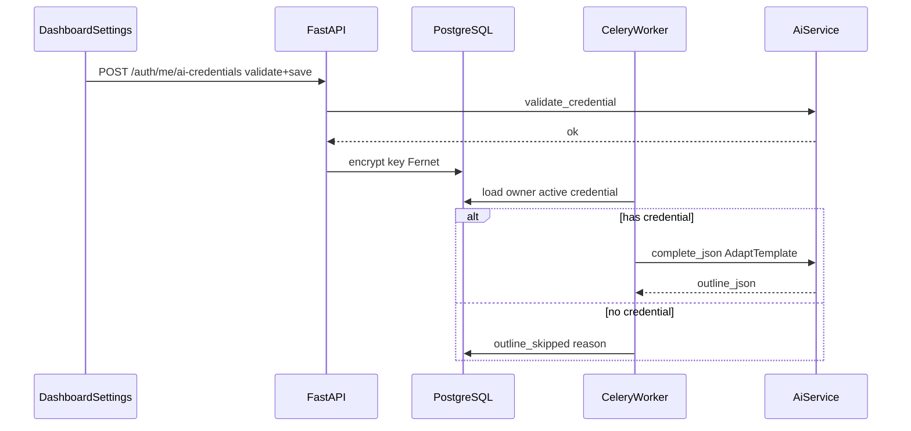
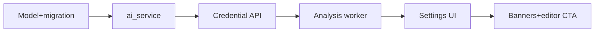

# BYOK AI providers implementation plan

## Locked product decisions (from grill)

| Decision | Choice |
|----------|--------|
| Platform AI spend | **StrictBYOK** — no `ANTHROPIC_API_KEY` required on server |
| Credential slots | **Multi-store, single active** — many keys; one active provider+model |
| Models | **Curated dropdown** per provider |
| Save flow | **Validate on save** — reject invalid keys before persist |
| Storage | **Dedicated table** + Fernet (reuse [`crypto_service.py`](backend/app/services/crypto_service.py)) |
| v1 providers | **Anthropic + Google AI Studio** |
| Missing key at analysis step 8 | **PartialComplete** — steps 1–7 succeed; outline skipped with reason |
| Settings UI | **Dashboard Settings tab** — new “AI providers” section |

Domain terms are already in [`CONTEXT.md`](CONTEXT.md) (**Provider credential**, **Active provider**).

## Current state (what changes)

- [`analysis_service.py`](backend/app/services/analysis_service.py) calls `settings.ANTHROPIC_API_KEY` directly in `generate_outline_with_claude()` (lines 515–567).
- [`config.py`](backend/app/config.py) requires `ANTHROPIC_API_KEY: str`.
- Celery worker invokes `run_outline_step(project_id, ...)` — can resolve `Project.owner_id` for credentials.
- Dashboard Settings ([`Dashboard.tsx`](frontend/src/pages/Dashboard.tsx) ~L265) has Profile / Git / Security only.
- Editor chat ([`RightPanel.tsx`](frontend/src/components/editor/RightPanel.tsx)) is still mock — wire a **credential check** stub so future AI routes share the same pattern.



---

## Phase 1 — Data model and config

### 1.1 New model `UserAiCredential`

File: [`backend/app/models/ai_credential.py`](backend/app/models/ai_credential.py) (new)

| Column | Type | Notes |
|--------|------|--------|
| `id` | PK | |
| `user_id` | FK users | indexed |
| `provider` | string enum | `anthropic`, `google` |
| `api_key_encrypted` | string | Fernet via `encrypt_token` / `decrypt_token` |
| `model_id` | string | curated ID |
| `is_active` | bool | at most one `true` per user |
| `key_hint` | string | last 4 chars for UI |
| `validated_at` | datetime | set on successful validate |
| `created_at` / `updated_at` | datetime | |

Unique constraint: `(user_id, provider)` — one row per provider per user.

Register in [`backend/alembic/env.py`](backend/alembic/env.py) and add migration (revises latest head `b2c3d4e5f6a7`).

### 1.2 Analysis partial-complete fields

Extend [`backend/app/models/analysis.py`](backend/app/models/analysis.py):

- `outline_skipped` (Boolean, default false)
- `outline_skip_reason` (String, nullable) — e.g. `no_ai_credential`

Expose in [`AnalysisStatusResponse`](backend/app/schemas/analysis.py) and `build_steps_payload()` so step 8 can show status `skipped` when `outline_skipped` and job is `completed`.

### 1.3 Config and docs

- [`backend/app/config.py`](backend/app/config.py): remove required `ANTHROPIC_API_KEY` (or `Optional[str] = None`).
- [`backend/.env.example`](backend/.env.example), [`README.md`](README.md), [`docker-compose.yml`](docker-compose.yml) worker notes: drop “required ANTHROPIC_API_KEY”; document BYOK in Settings instead.

### 1.4 Curated provider catalog (code constant)

File: [`backend/app/ai_providers.py`](backend/app/ai_providers.py) (new) — no DB

```python
PROVIDERS = {
  "anthropic": {"label": "Anthropic (Claude)", "models": [...]},
  "google": {"label": "Google AI Studio", "models": [...]},
}
```

Initial model IDs (adjust after you confirm free-tier names in AI Studio):

- Anthropic: `claude-sonnet-4-20250514` (matches current outline call)
- Google: `gemini-2.0-flash` (or current free flash model ID)

`GET /auth/me/ai-providers/catalog` returns this list (no secrets).

---

## Phase 2 — `ai_service` abstraction

File: [`backend/app/services/ai_service.py`](backend/app/services/ai_service.py) (new; referenced in PAGEMARK but missing today)

**Public API:**

- `validate_credential(provider, api_key, model_id) -> None` (raises with user-safe message)
- `complete_text(system: str, user: str, provider, api_key, model_id) -> str`

**Adapters:**

| Provider | SDK | Validate strategy |
|----------|-----|-------------------|
| `anthropic` | existing `anthropic` | minimal `messages.create` (max_tokens=16) or official ping |
| `google` | add `google-genai` to [`requirements.txt`](backend/requirements.txt) | minimal `generate_content` on `model_id` |

Keep JSON outline parsing in `analysis_service`; `ai_service` only returns raw text.

Rename/refactor: replace `generate_outline_with_claude()` with `generate_outline_with_ai(credential, template_sections, artifacts)` that calls `ai_service.complete_text()`.

---

## Phase 3 — Credential CRUD service and routes

File: [`backend/app/services/ai_credential_service.py`](backend/app/services/ai_credential_service.py) (new)

- `list_credentials(user_id)` — mask keys (`key_hint` only)
- `upsert_credential(user_id, provider, api_key, model_id)` — validate → encrypt → upsert; do not return raw key
- `set_active(user_id, credential_id)` — clear other `is_active`, set one
- `delete_credential(user_id, credential_id)`
- `get_active_credential(user_id) -> UserAiCredential | None` — decrypt key in memory only inside worker/service

File: [`backend/app/schemas/ai_credential.py`](backend/app/schemas/ai_credential.py) (new)

Schemas: `AiCredentialResponse` (no secret), `AiCredentialUpsertRequest` (provider, api_key, model_id), `AiProviderCatalogResponse`.

**Routes** — extend [`backend/app/routers/auth.py`](backend/app/routers/auth.py) under `/auth/me/...` (user already has `GET /auth/me`):

| Method | Path | Behavior |
|--------|------|----------|
| GET | `/auth/me/ai-providers/catalog` | Curated providers + models |
| GET | `/auth/me/ai-credentials` | List masked credentials + which is active |
| PUT | `/auth/me/ai-credentials/{provider}` | Validate on save, upsert |
| POST | `/auth/me/ai-credentials/{id}/activate` | Set active |
| DELETE | `/auth/me/ai-credentials/{id}` | Remove |

Alternative: new [`backend/app/routers/users.py`](backend/app/routers/users.py) if you prefer separation from auth — either is fine; auth `/me` is fewer files.

---

## Phase 4 — Wire analysis worker (PartialComplete)

Update [`run_outline_step`](backend/app/services/analysis_service.py):

1. Load `project_id` → `Project.owner_id`.
2. `get_active_credential(owner_id)`.
3. **If none:**  
   - `update_analysis_step(..., status=COMPLETED, outline_skipped=True, outline_skip_reason="no_ai_credential", step_detail="Add an API key in Settings to generate outline")`  
   - Do not raise; return empty outline.
4. **If present:** run AdaptTemplate via `ai_service`; existing auto-apply / `outline_json` logic unchanged.

Worker pre-step message in [`analysis_worker.py`](backend/app/workers/analysis_worker.py) can stay; handle skip inside `run_outline_step` only.

---

## Phase 5 — Frontend Settings UI

### 5.1 API + types

- [`frontend/src/types/index.ts`](frontend/src/types/index.ts): `AiProviderCatalog`, `AiCredential`, etc.
- [`frontend/src/api/aiCredentials.ts`](frontend/src/api/aiCredentials.ts) (new): catalog, list, upsert, activate, delete.
- [`frontend/src/hooks/useAiCredentials.ts`](frontend/src/hooks/useAiCredentials.ts) (new): TanStack Query + mutations with toast errors.

### 5.2 UI component

New [`frontend/src/components/settings/AiProvidersSection.tsx`](frontend/src/components/settings/AiProvidersSection.tsx):

- Provider cards (Anthropic / Google)
- Per card: status (connected / not), masked hint, model `<select>` from catalog
- API key password input + **Save & validate** (disabled while validating)
- **Set active** radio/toggle across saved providers
- **Remove** with confirm
- Link text: “Keys are encrypted; never shared with other users”

Insert into Settings tab in [`Dashboard.tsx`](frontend/src/pages/Dashboard.tsx) after “Connected accounts”.

### 5.3 Analysis + editor surfacing

- [`AnalysisProgress.tsx`](frontend/src/components/analysis/AnalysisProgress.tsx) / [`Analysis.tsx`](frontend/src/pages/Analysis.tsx): if `outline_skipped` + `outline_skip_reason === 'no_ai_credential'`, show banner with link to Settings (`setActiveTab('settings')` or hash).
- [`NewProject.tsx`](frontend/src/pages/NewProject.tsx) processing step: same banner if completed with skip.
- [`RightPanel.tsx`](frontend/src/components/editor/RightPanel.tsx): before mock send, `useAiCredentials` — if no active credential, show inline CTA instead of fake streaming (prep for real AI later).

---

## Phase 6 — Security and ops

- Reuse Fernet from [`crypto_service.py`](backend/app/services/crypto_service.py); consider renaming helpers to `encrypt_secret` / `decrypt_secret` (optional alias, not required).
- Never log API keys; never include in API responses after save.
- Rate-limit validate endpoint lightly (optional v1: skip).
- Celery worker needs same `ENCRYPTION_KEY` as API to decrypt — already in `.env` for OAuth.

---

## Phase 7 — Testing

- **Unit:** `ai_credential_service` upsert/active uniqueness; `ai_service` adapters mocked.
- **Unit:** `run_outline_step` with no credential → `outline_skipped` without exception.
- **Manual:** Settings save invalid key → 400; valid key → active; analysis completes with outline; remove key → re-run analysis → artifacts OK, banner shown.

---

## Suggested implementation order



1. Model + migration + config optional API key  
2. `ai_providers.py` + `ai_service.py` + requirements (`google-genai`)  
3. `ai_credential_service` + auth routes  
4. Refactor `analysis_service` + status schema for `outline_skipped`  
5. Frontend Settings section  
6. Analysis/NewProject/Editor banners  

---

## Out of scope (Phase 1b from grill)

- AI template builder from repo  
- Per-feature provider routing  
- OpenAI / other vendors  
- Platform-funded hybrid tier  

---

## Files summary

| Area | New / changed |
|------|----------------|
| Backend model | `models/ai_credential.py`, `models/analysis.py` |
| Backend services | `services/ai_service.py`, `services/ai_credential_service.py`, `services/analysis_service.py` |
| Backend API | `schemas/ai_credential.py`, `routers/auth.py` (or `users.py`) |
| Backend config | `config.py`, `ai_providers.py`, `requirements.txt`, `.env.example` |
| Frontend | `api/aiCredentials.ts`, `hooks/useAiCredentials.ts`, `components/settings/AiProvidersSection.tsx`, `Dashboard.tsx`, `Analysis*.tsx`, `RightPanel.tsx` |
| Docs | `README.md`, `CONTEXT.md` (only if new terms needed) |
