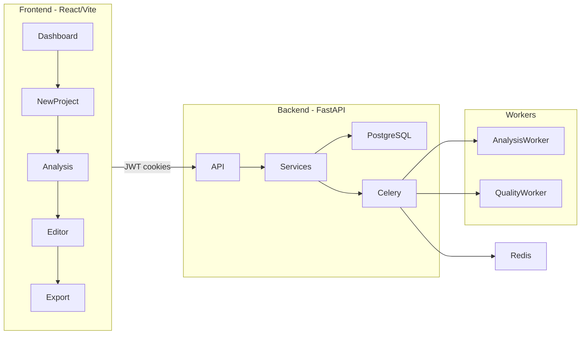

# Pagemark Architecture and Planning Workshop

## Decisions Confirmed So Far

| Decision | Your choice |
|----------|-------------|
| **Tenancy** | Migrate to org-based multi-tenancy **now**, before other major features |
| **Delivery scope** | **Hybrid** — academic must-haves first, then product vision from [my_thoughts.md](my_thoughts.md) |
| **Auth** | Recommended flow: Email verification on signup, password login, optional OTP in settings |
| **Editor** | Step 1 (UX fix) + Option B (Relational dynamic sections) aiming for Notion-like flow |
| **Git Scope** | GitHub-only for Phase 1. Strip GitLab. |
| **Analysis Scope**| Python, TypeScript/JS, and **Java (Mandatory)** |
| **Timeline** | 1 month deadline, full-time work |
| **Export Customization** | Approved (Logo, Colors, Fonts for PDF) |
| **Collaboration** | Share links for V1. Liveblocks multiplayer deferred to post-V1. |
| **Deployment** | Local Docker for V1, Cloud deployment deferred. |
| **Context Workflow** | **Agentic Clarification Loop** (HITL) in the editor chat. |
| **BYOK Model** | **Simplified** (1:1 mapping, premium UI, simple backend). |

---

## Phase 1: Codebase Analysis Summary

### What Pagemark Is Today

An AI-assisted documentation system: ingest code (ZIP/Git) → Celery analysis → AI-adapted outline → section-by-section editing with BYOK AI → quality scoring → export (MD/HTML/PDF).



### Tech Stack (Implemented)

| Layer | Stack |
|-------|-------|
| Frontend | React 19, TypeScript, Vite 8, TanStack Query, Zustand, Tailwind, CodeMirror 6 |
| Backend | FastAPI, SQLAlchemy 2.0 async, PostgreSQL 16, Alembic, Celery + Redis |
| Auth | JWT in httpOnly cookies; bcrypt passwords |
| AI | BYOK (Anthropic + Google credentials encrypted with Fernet) |
| Analysis | Tree-sitter (Python/JS/Java), regex endpoint detection |
| Export | Sync in API route — MD, HTML (WeasyPrint PDF) |

### Documentation vs Reality — Critical Drift

Three specs disagree. **Code follows the oldest model:**

| Topic | [PAGEMARK_V2.md](PAGEMARK_V2.md) / [claude_session_information.md](claude_session_information.md) | [backend/PAGEMARK.md](backend/PAGEMARK.md) (stale) | **Actual code** |
|-------|---|---|---|
| Project ownership | `org_id` → organizations | `owner_id` → users | **`owner_id` → users** |
| Roles | Per-org: admin, pm, dev, tw, viewer | `user_roles` table | **`user_roles` (USER/ADMIN) — never enforced** |
| Email verification | Required before login | Mentioned | **Not implemented** |
| Sharing / comments | Full model | Documented | **No models or routes** |
| Audit logs | Full model | Documented | **Not implemented** |
| Knowledge base | Full model | Documented | **Frontend placeholder only** |
| Export worker | Celery async | Documented | **Sync in router** |
| Google BYOK | All AI features | N/A | **Analysis outline only; chat/generate/refine Anthropic-only** |

[CONTEXT.md](CONTEXT.md) is accurate for domain language (Analysis, Template, Outline, AdaptTemplate, BYOK) and should remain the glossary source of truth.

---

### Frontend — Current State

**Strengths:**
- Full project lifecycle wired: dashboard → 4-step wizard → analysis page → three-panel editor
- CodeMirror stack with live preview, tables, slash/bubble menus
- BYOK settings UI, Git OAuth (GitHub + GitLab), quality modal, export modal
- Clean layering: pages → hooks (React Query) → api (Axios)

**Weaknesses / incomplete:**
- **Editor UX** — per-section scroll boxes; TOC doesn't live-update; refinement accept bypasses `POST /ai/accept` (loses version lineage)
- **AI panel** — Agent/Chat/History tabs confusing; Context tab exists but hidden; chat uses only first thread
- **Dead code** — `editorStore`, `SectionEditor`, `DiffViewer`, `PageShell`, unused `useAutosave`
- **Placeholders** — Knowledge Base page, Share button (no handler), profile save (local Zustand only)
- **No org switcher, no role-based UI, no onboarding wizard**
- **Zero frontend tests**

Key files: [frontend/src/pages/EditorPage.tsx](frontend/src/pages/EditorPage.tsx), [frontend/src/components/editor/MiddlePanel.tsx](frontend/src/components/editor/MiddlePanel.tsx), [frontend/src/components/editor/RightPanel.tsx](frontend/src/components/editor/RightPanel.tsx)

---

### Backend — Current State

**Strengths:**
- Solid service/router separation; prompts in [backend/app/prompts/](backend/app/prompts/)
- 8-step analysis pipeline with AdaptTemplate (BYOK-gated)
- Section versioning with diff/restore
- OAuth token + BYOK key encryption
- Quality scoring via Celery

**Weaknesses / incomplete:**
- **No org layer** — all auth is `Project.owner_id == current_user.id` (IDOR risk if any route misses the check)
- **No centralized ownership helpers** — inline filters repeated across routers
- **Known bug** — [backend/app/routers/versions.py](backend/app/routers/versions.py) uses `datetime.utcnow()` without import (restore likely broken)
- **Google AI parity gap** — BYOK catalog includes Google but doc AI features are Anthropic-only
- **Missing routers** — users, organizations, sharing, knowledge, audit
- **Export** — sync, no DOCX despite dep; no customization (fonts, branding)
- **Tests** — only [backend/tests/test_analysis_service.py](backend/tests/test_analysis_service.py); pytest not in requirements.txt
- **No CI/CD, no API Docker image, no production config**

---

### Infrastructure

- [docker-compose.yml](docker-compose.yml): Postgres (5433), Redis, Celery worker only — API and frontend run manually
- No `.github/workflows/`, no staging/prod env matrix
- `ENCRYPTION_KEY` auto-generates if empty — **data loss on restart** in dev; dangerous if mistaken for prod behavior

---

## Phase 2: Recommendations on Open Decisions

### Auth Model — Recommendation

Your proposed flow (email verify on signup + OTP on re-login after logout + session persistence + optional disable) is **workable but heavier than needed** for a documentation tool and a student project.

**Recommended approach:**

```
Signup → email link verification (block login until verified)
Login  → password + JWT cookies (access 30m, refresh 7d)
       → auto-login on return via refresh cookie (already implemented)
Logout → clear cookies
Re-login → password only (no OTP by default)

Settings → "Enable login verification" toggle (email OTP on each login)
           OFF by default for daily-use UX
           ON for demo of security/MFA feature
```

**Why not OTP on every post-logout login by default:**
- Documentation tools expect frictionless daily access (like Notion, GitHub)
- Email OTP adds SMTP dependency, rate limiting, OTP storage/expiry, lockout edge cases
- Evaluators testing repeatedly will find it annoying unless they know to disable it
- Email **link verification on signup** alone satisfies Module 1 trust requirements

**What to build for academic must-haves:**
1. Email link verification on registration (required)
2. Organization + role on registration form (feeds org migration)
3. Account activity log viewer (audit_logs — new table)
4. Role-based dashboard tabs (after org migration)
5. API key management (user_api_keys — new table per PAGEMARK_V2)
6. Optional email OTP MFA in settings (Priority 2 unless evaluator explicitly tests it)

**Decision required:** Accept recommended auth flow, or insist on mandatory OTP on every login after logout?

---

### Editor Direction — Recommendation

**The core problem is likely UX architecture, not CodeMirror itself.**

Your backend models documentation as discrete **Sections** (H1/H2, status, versions, AI per section). That is correct for Pagemark's workflow. The frontend renders each section as an isolated scroll box — that creates the "constrained box" feeling regardless of editor library.

**Recommended path (3 steps):**

**Step 1 — Fix without migration (1 week, low risk):**
- Single continuous scroll container for all sections
- Remove per-section scroll boxes and box borders
- Fix TOC live-update (subscribe to section heading changes in editor state, not page reload)
- Wire `@section` references in AI composer to section IDs
- Fix refinement accept → call `POST /sections/{id}/ai/accept`
- Merge Agent + Chat tabs; move History to header

**Step 2 — Spike only if Step 1 fails (2-3 days):**
- Prototype Milkdown AND MDXEditor with: per-section diff, version restore, `@` mentions, table editing
- Score against: diff support, section boundary sync, bundle size, learning curve

**Step 3 — Migrate only if spike wins clearly:**
- Milkdown is the stronger fit IF you want Notion-like block editing
- MDXEditor is simpler if you stay in "one textarea per section" model
- **Do not migrate before org migration and editor UX fix** — migration during tenancy rewrite doubles rework

**Decision required:** Proceed with Step 1 (fix CodeMirror UX) first, or skip straight to editor spike/migration?

---

### Remaining Decision Gates (Not Yet Discussed)

These will be resolved in subsequent workshop rounds:

| # | Topic | Options | Blocks |
|---|-------|---------|--------|
| 3 | **Git providers** | GitHub-only ([my_thoughts.md](my_thoughts.md)) vs keep GitLab | OAuth scope, NewProject UI |
| 4 | **Analysis language scope** | Keep Python/JS/Java vs narrow to 1-2 frameworks | Analysis worker, demo reliability |
| 5 | **Guided questionnaire** | Distinct Module 4 flow vs enhanced AI chat | Major frontend feature, DB schema |
| 6 | **BYOK model** | Current (one active provider) vs [my_thoughts.md](my_thoughts.md) (primary + secondary keys, dynamic models) | Settings UI, ai_service refactor |
| 7 | **Export customization** | Basic formats now vs full branding/fonts preview | Export service architecture |
| 8 | **Real-time collaboration** | Descope (recommended) vs Liveblocks/Yjs | Major infra |
| 9 | **Deployment target** | Local demo only vs cloud deploy for submission | CI/CD, Docker, env matrix |
| 10 | **Submission deadline** | Date unknown — affects phase ordering | Everything |

---

## Risks Register

### Technical Risks

| Risk | Severity | Mitigation |
|------|----------|------------|
| Org migration breaks all existing routes/data | High | Migration script: personal org per user, reassign `owner_id` → `org_id`; feature-flag rollout |
| Editor rewrite during org migration | High | Sequence: org first, editor UX second |
| IDOR via sequential integer IDs | High | Centralize `verify_project_access` / `verify_section_access` in [backend/app/dependencies.py](backend/app/dependencies.py) as part of org work |
| Google BYOK half-implemented | Medium | Either full parity in `ai_doc_service` or remove from catalog until ready |
| PDF export fails in Docker | Medium | Add WeasyPrint OS deps to Dockerfile; test in CI |
| `versions.py` datetime bug | Medium | Fix in first maintenance prompt |
| No tests | High | Add pytest + critical path tests per phase |

### Product Risks

| Risk | Severity | Notes |
|------|----------|-------|
| Guided questionnaire missing | High | Core differentiator per [claude_session_information.md](claude_session_information.md) Priority 1 |
| Scope creep (40+ Priority 1/2 items) | High | Hybrid scope requires strict phasing |
| Editor dissatisfaction blocks daily use | High | Step 1 UX fix before feature additions |

### AI Risks

| Risk | Severity | Notes |
|------|----------|-------|
| BYOK friction — users can't demo without own key | Medium | Consider demo mode with platform key for evaluators only |
| Token cost on full prefill | Medium | Already sequential; add estimates (partially exists) |
| AI hallucination in docs | Medium | Confidence scores (Priority 2) |

### Security Risks

| Risk | Severity | Notes |
|------|----------|-------|
| Celery tasks without user_id re-verification | Medium | Pass `user_id` + org membership check in all tasks |
| Auto-generated ENCRYPTION_KEY | High | Fail startup if missing in non-dev |
| No rate limiting on auth/AI endpoints | Medium | Add before any public deploy |

---

## Proposed Phase Sequence (Pending Remaining Decisions)

Given **org_now + hybrid**, the recommended build order minimizes rework:

### Phase 0 — Foundation and Doc Alignment
- Reconcile [PAGEMARK_V2.md](PAGEMARK_V2.md) as canonical backend spec; mark [backend/PAGEMARK.md](backend/PAGEMARK.md) deprecated
- Update [CONTEXT.md](CONTEXT.md) with org terms (Organization, Membership, Personal org)
- Fix known bugs (versions datetime, refinement accept path)
- Add `verify_*` ownership dependencies
- Add pytest to requirements, baseline test harness

### Phase 1 — Org Multi-Tenancy (Direction-Changing)
- DB: `organizations`, `organization_members`; migrate `projects.owner_id` → `org_id` + `created_by`
- Backend: `organizations` router, `require_org_role`, update all project routes
- Frontend: org switcher, `orgStore`, update all API paths
- Registration: org name, role, email verification
- Personal org auto-creation on signup

### Phase 2 — Academic Must-Haves (Module 1)
- Email verification flow
- Role-based dashboard tabs
- Account activity log (audit_logs)
- API key management
- File exclusion on upload (Module 2)

### Phase 3 — Guided Questionnaire (Module 4 — Core Differentiator)
- Structured questionnaire flow separate from free chat
- Progress tracker, skip/revisit, gap analysis, draft/resume
- New DB tables: `questionnaire_sessions`, `questionnaire_answers`

### Phase 4 — Editor UX Overhaul
- Step 1 CodeMirror fixes (continuous scroll, live TOC, AI panel restructure)
- `@section` references in AI composer
- Version history diff wired
- Optional: editor spike if unsatisfied

### Phase 5 — Analysis Improvements
- GitHub-only (if decided)
- Dependency graph visualizer
- Narrowed framework support (if decided)

### Phase 6 — Collaboration and Workflow
- Sharing, comments (from PAGEMARK_V2 schema)
- Approval workflow (Draft → In Review → Approved)
- Notifications (email)

### Phase 7 — Export and Quality Enhancements
- Export customization (branding, fonts, preview)
- Quality thresholds, NLP dashboard
- Tagging, full-text search

### Phase 8 — BYOK v2 (if decided)
- Primary/secondary keys, dynamic model list per key

### Phase 9 — Production Readiness
- CI/CD, API Dockerfile, env matrix
- Security testing prompts
- Performance testing
- Release readiness review

---

## Phase 3-6 Deliverables (After All Decisions)

Once decision gates 3-10 are resolved in follow-up workshop sessions:

1. **Architecture Review Document** — system, DB, AI, auth, authz, context, export, versioning, deployment, scalability; what stays/changes/removes
2. **Master Roadmap** — phased with dependencies, success metrics, and "why this phase exists"
3. **`prompts/` folder** — `prompt_001.md` through `prompt_NNN.md` in execution order, each self-contained for a coding agent
4. **Testing prompts** — `prompt_900_system_testing.md`, `prompt_901_security_testing.md`, `prompt_902_performance_testing.md`, `prompt_999_release_readiness.md`

Each implementation prompt will include: Objective, Context, Requirements, Architecture Notes, Backend/Frontend/Database/AI Tasks, Security, Testing, Acceptance Criteria, Validation Checklist.

---

## Workshop Next Step

Per grill-with-docs: **one decision at a time.**

**Immediate next questions for you:**

1. **Auth:** Accept recommended flow (email link on signup, password login, optional OTP in settings)? Or mandatory OTP on every login after logout?

2. **Editor:** Proceed with Step 1 CodeMirror UX fix before any migration spike?

3. **Deadline:** What is your submission/demo date? (Determines how many Priority 2 items fit.)

After these three answers, we proceed to decision gates 3-6 (Git scope, questionnaire, BYOK, deployment) and then produce the full architecture review + roadmap + prompt library.
