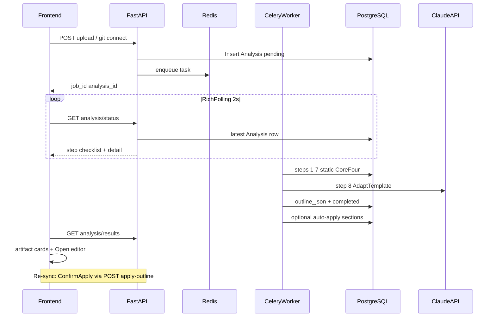

# Full codebase analysis + progress UI

## Decisions locked (from grill)

| Topic | Choice |
|-------|--------|
| Post-analysis outcome | **Artifacts + AI outline** (no auto full prose) |
| Template integration | **AdaptTemplate** — template skeleton, AI adjusts headings from analysis |
| Static artifacts v1 | **CoreFour** on `analyses`: `file_tree_json`, `languages_json`, `endpoints_json`, `complexity_json` |
| Languages v1 | **Python, TS/JS, Java** parsed deeply; others detected shallowly |
| Progress UX | **RichPolling** — extended status API + checklist + artifact summary; pending timeout |
| Worker infra | **Celery worker in docker-compose** + shared volumes |
| AI outline | **Step 8 in same Celery task** after static analysis |
| Re-sync | **ConfirmApply** — auto-apply outline only on first run when sections untouched; later runs require explicit Apply |
| AI template builder | **Phase 1b** (after v1); v1 keeps existing template picker |

## Domain language (create [`CONTEXT.md`](CONTEXT.md) at repo root)

Glossary only (no implementation):

- **Analysis** — background job producing repo facts (CoreFour JSON) for one ingest.
- **Template** — reusable outline pattern (`sections_json`), not prose.
- **Outline** — concrete `Section` rows in the project Document.
- **AdaptTemplate** — AI adjusts template headings using Analysis facts.

## Architecture



## Backend implementation

### 1. New [`backend/app/services/analysis_service.py`](backend/app/services/analysis_service.py)

Centralize logic (per [PAGEMARK.md](backend/PAGEMARK.md)):

- **Ingest**: unzip ZIP to `uploads/{project_id}/extracted/`; validate size/file count caps.
- **Walk**: build `file_tree_json` with ignore rules (`node_modules`, `.git`, `dist`, `__pycache__`, `.venv`, etc.).
- **Languages**: extension + tree-sitter grammars for Python, TS/JS, Java; shallow detection for others.
- **Endpoints**: language-specific extractors (e.g. FastAPI `@router`, Flask routes, Express `app.get`, Spring `@GetMapping` heuristics).
- **Complexity**: file counts, LOC estimates, top-N largest files, per-language breakdown.
- **Progress callbacks**: `update_step(analysis_id, step, detail: str | None)` for RichPolling.
- **AdaptTemplate**: load project `template_id` → `Template.sections_json` + CoreFour → call [`app/prompts/outline.py`](backend/app/prompts/outline.py) (new) → return `outline_json` (list of `{heading, description?, order_index}`).
- **Apply outline**: `apply_outline_to_document(project_id, outline, mode=auto|manual)` implementing ConfirmApply (only auto if all sections `pending` + empty `content_md`).

Add tree-sitter language bindings to [`backend/requirements.txt`](backend/requirements.txt) (python, javascript/typescript, java grammars).

### 2. Refactor [`backend/app/workers/analysis_worker.py`](backend/app/workers/analysis_worker.py)

Replace `_run_mock_analysis_pipeline` + sleeps with real steps:

| Step | Name | Work |
|------|------|------|
| 1 | Connect | Validate source / auth URL |
| 2 | Extract | Unzip or use clone path |
| 3 | Languages | CoreFour languages |
| 4 | Parse | Tree-sitter pass primary langs |
| 5 | Endpoints | Route extraction |
| 6 | Complexity | Metrics |
| 7 | Finalize | Persist four JSON columns on `Analysis` |
| 8 | Outline | Claude AdaptTemplate → `outline_json`; auto-apply if ConfirmApply rules pass |

Set `total_steps = 8`. On failure: set `failed`, keep partial JSON if steps 3-7 completed, set `step_number` to failed step (not `0`).

Fix [`connect_oauth_git`](backend/app/routers/projects.py): select OAuth token by **provider matching repo** (not `order_by updated_at` only).

### 3. Schema / API

**Migration**: add `outline_json` (JSON) and optional `step_detail` (String) on `analyses`; bump default `total_steps` to 8.

**Extend** [`AnalysisStatusResponse`](backend/app/schemas/analysis.py):

```python
step_detail: Optional[str]
steps: list[{number, name, status: pending|running|done|failed}]
elapsed_seconds: Optional[int]
```

Compute `steps` server-side from `step_number` + `status` + fixed step names.

**New endpoints** (in [`projects.py`](backend/app/routers/projects.py) or dedicated [`analysis.py`](backend/app/routers/analysis.py) router per PAGEMARK layout):

- `GET /projects/{id}/analysis/results` → full [`AnalysisResponse`](backend/app/schemas/analysis.py) (CoreFour + `outline_json`)
- `POST /projects/{id}/analysis/apply-outline` → apply latest completed analysis `outline_json` to sections (manual ConfirmApply)
- Optional: `GET /projects/{id}/analysis/outline-diff` → old headings vs proposed for UI

### 4. Infrastructure

Update [`docker-compose.yml`](docker-compose.yml):

- `worker` service: same build as API, command `celery -A app.workers.celery_app worker --loglevel=info`
- Volumes: `uploads`, `/tmp/pagemark_repos` shared with API
- Document in [`README.md`](README.md): `docker compose up` runs db + redis + worker

## Frontend implementation

### 1. Types + API ([`frontend/src/types/index.ts`](frontend/src/types/index.ts), [`frontend/src/api/analysis.ts`](frontend/src/api/analysis.ts))

- Extend `AnalysisStatus` with `step_detail`, `steps[]`, `elapsed_seconds`
- Add `AnalysisResults` type matching full response
- `getAnalysisResults`, `applyOutline`

### 2. Hooks ([`frontend/src/hooks/useAnalysis.ts`](frontend/src/hooks/useAnalysis.ts))

- Keep 2s polling; add **stale pending guard**: if `pending` for >60s without `started_at`, surface `workerUnavailable` hint
- Add **max poll duration** (e.g. 15 min) → toast + stop spinner
- `useAnalysisResults(projectId)` when `completed`
- `useApplyOutline()` mutation

### 3. UI components

**New** [`frontend/src/components/analysis/AnalysisProgress.tsx`](frontend/src/components/analysis/AnalysisProgress.tsx):

- Vertical checklist of 8 steps (check/spinner/pending icons)
- `current_step` + `step_detail` + elapsed timer

**New** [`frontend/src/components/analysis/AnalysisResults.tsx`](frontend/src/components/analysis/AnalysisResults.tsx):

- Cards: languages breakdown, endpoint count/list preview, file tree collapsible, complexity highlights

**New** [`frontend/src/components/analysis/OutlineProposal.tsx`](frontend/src/components/analysis/OutlineProposal.tsx):

- Heading diff (added/removed/renamed) when re-sync; **Apply outline** button → `applyOutline`

### 4. Pages

- [`frontend/src/pages/NewProject.tsx`](frontend/src/pages/NewProject.tsx) — replace `ProcessingStep` with `AnalysisProgress`; on complete navigate to Analysis (unchanged) or editor if scratch
- [`frontend/src/pages/Analysis.tsx`](frontend/src/pages/Analysis.tsx) — running: `AnalysisProgress`; completed: `AnalysisResults` + `OutlineProposal` when `outline_json` pending apply; failed: actionable error + retry sync

Template picker in New Project: **no change in v1** (Phase 1b for AI template builder).

## Testing

- **Backend unit tests**: `analysis_service` on fixture repos (small FastAPI + React sample) — languages, endpoints, tree ignore
- **Worker integration**: enqueue task with Redis test container or mocked `analysis_service`
- **Frontend**: manual checklist against running compose stack

## ADR candidates (create only if you want written rationale)

1. **Step 8 in-worker** vs chained task — single job simplifies ConfirmApply and status polling
2. **ConfirmApply** on re-sync — protects user edits
3. **Celery worker in compose** — avoids “pending forever” dev trap

## Phase 1b (follow-up, not in v1 scope)

- “Create template from repo” using analysis artifacts
- Deeper polyglot parsers (Go, Rust, etc.)
- SSE progress (only if RichPolling proves insufficient)

## Key files to touch

| Area | Files |
|------|--------|
| Service | `backend/app/services/analysis_service.py` (new), `app/prompts/outline.py` (new) |
| Worker | `backend/app/workers/analysis_worker.py` |
| API | `backend/app/routers/projects.py`, `backend/app/schemas/analysis.py` |
| Model | `backend/app/models/analysis.py` + Alembic migration |
| Infra | `docker-compose.yml`, `README.md` |
| UI | `AnalysisProgress.tsx`, `AnalysisResults.tsx`, `OutlineProposal.tsx`, `Analysis.tsx`, `NewProject.tsx`, `useAnalysis.ts`, `analysis.ts` |
